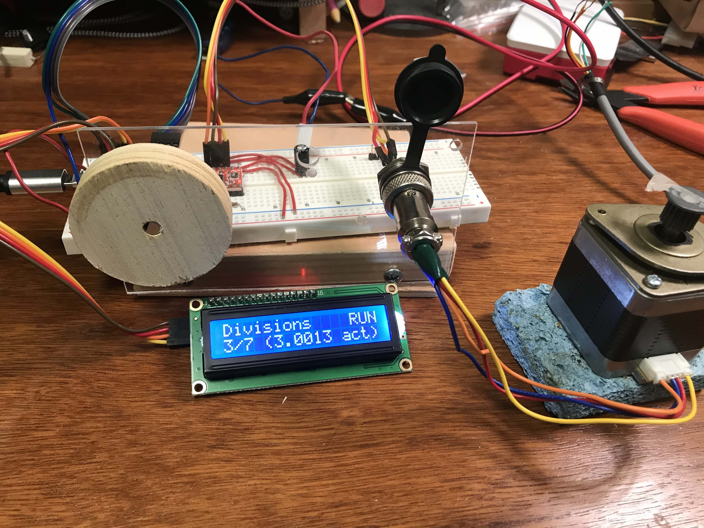
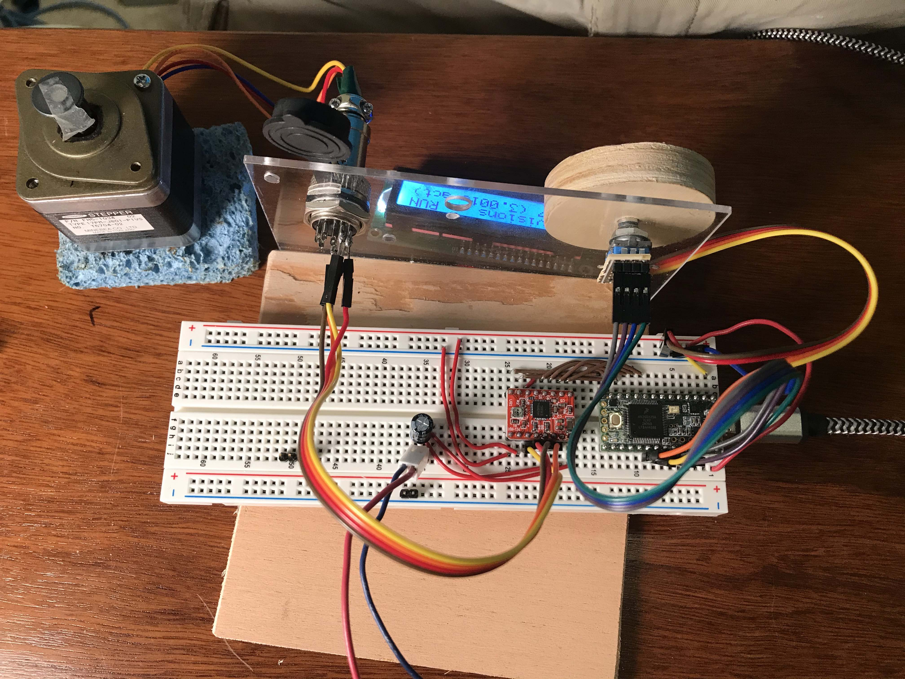
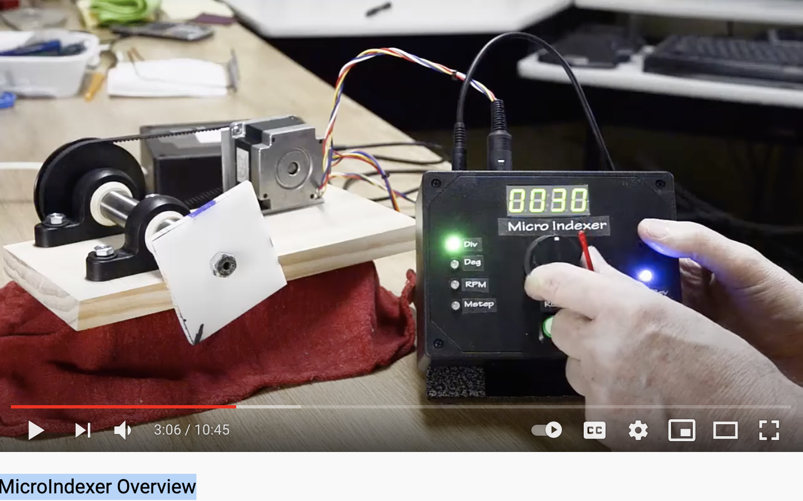

# MicroIndexer -- A stepper-based dividing head

This project uses a Teensy microcontroller, an LCD, and a rotary encoder to control a the rotation of a stepper motor.

    https://github.com/drf5n/MicroIndexer
    Based on the MicroIndexer shown at
    https://www.youtube.com/watch?v=0ACs5FRYcTE 
    Using an encoder, lcd, stepper driver, and Teensy 3.2.

* 
* 

##  Hardware:

*  Microcontroller - Teensy 3.2 : https://www.pjrc.com/store/teensy32.html
*  Display - 2x16 I2C Liquid Crystal Display
*  Control - 20 detent rotary encoder button (KY-040 ?)
*  Stepper Motor -  NEMA 17 bipolar stepper motor 200 steps/rev
*  Motor Driver - A4988 stepper driver board like https://www.pololu.com/product/1182
*  Misc: breadboard, plexiglass, plywood knob, etc. 

# Inspiration:

* .
*  http://www.liming.org/millindex/ -- Excellent advice I found after the fact.  I particularly like the mechanical advice of the ER25/ER16 collet chuck shank.  
I think I'll use plain/split bushing bearings to enable a simple, solid spindle lock.  I'll also leave the stepper adjustable to allow for making & change to a (21? 27? 63?) tooth pulley and get integral ratios as needed.
* https://hackaday.com/2016/08/29/how-accurate-is-microstepping-really/ -- a good article on microstepping accuracy.

I tried this on an Arduino Uno, but at the high resolution step rates, I liked the faster clock speed of the Teensy.  The
[AccelStepper](https://www.airspayce.com/mikem/arduino/AccelStepper/) library recommends 1000 steps/sec max on a 16MHz machine, 
so at 3200 microsteps/rev, that's a maximum speed of 0.3125 rev/sec (18.75 RPM).

drf5n

